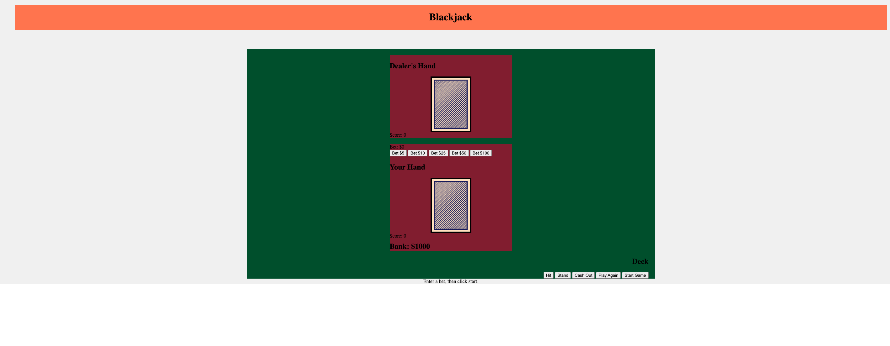
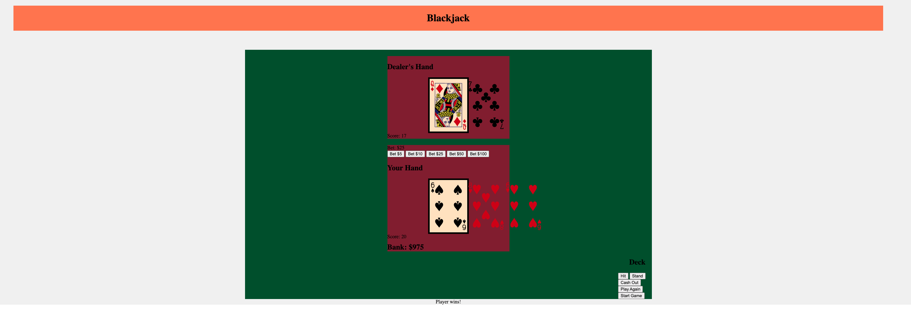

# Blackjack Game

## Description
This project involves creating a simple Blackjack game using HTML, CSS, and JavaScript. The game will allow players to play against the computer (dealer) in a simplified version of the classic casino game Blackjack.

## Technology used:
- HTMl
- CSS
- JS

## UI wireframe
ingame text:

winner screen:

## Getting Started:
- click this link to go to the game: https://therealgman2016.github.io/Blackjack/
- click one of the bet buttons to place your bet
- click start game

### Objective
The objective of Blackjack is to get a hand value as close to 21 as possible without going over.

## Future Enhancements
- Splitting pairs
- Doubling down
- Improved user interface
- Multiplayer mode